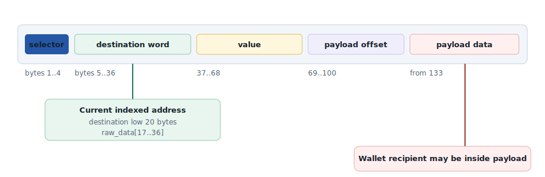
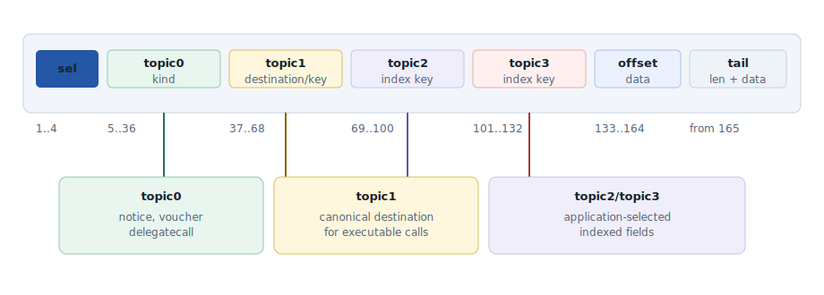
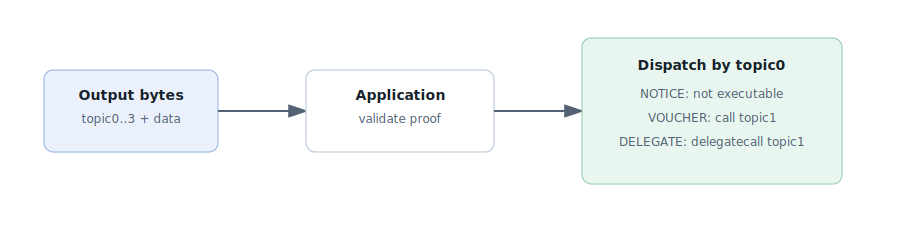

# Output Indexing

> [!WARNING]
> **This specification is still in draft**
> 
> It may contain errors, given that it was produced with the help of LLMs.
> If you find any errors, please report them in this document.

A single canonical output envelope for notices, vouchers, and delegate-call vouchers. Outputs remain Merkle-committed bytes, while selected fields become first-class fixed-position topics that PostgreSQL and SQLite can index.

## 0. Timeline

- 29 July 2025: [Discord thread](https://discord.com/channels/600597137524391947/1399773049737318501) opened by Guilherme Dantas
- 31 July 2025: [Presentation](https://docs.google.com/presentation/d/1YcXZpcpiuFk4odgJY2bQ5dUHXC71gnf-tY-TQHVuQI8/edit?usp=sharing) given by Guilherme Dantas
- 8 June 2026: [Draft spec HTML page](https://drive.google.com/file/d/1SfO8uWITMaEdNcjmCNa9nTy0R_LZmDTQ/view?usp=sharing) produced by Victor Fusco
- 11 June 2026: Draft spec converted to Markdown by Guilherme Dantas

## 1. Problem

The current JSON-RPC output API can list outputs and filter by the outer output selector and by the voucher destination. That is not enough for external indexers or user-facing applications.

A common example is a token withdrawal. The voucher destination may be the token contract, while the user's wallet is buried inside the voucher payload as token calldata. The database can index the destination, but it cannot index the wallet without either decoding payloads or relying on fragile payload-specific byte offsets.

> [!IMPORTANT]
> **The design goal**
>
> If a field should be used as a server-side filter, the application should place that field in a canonical topic slot when it emits the output. The node indexes the topic slot, not decoded application payloads.

## 2. Current Design

Today, the output ABI defines three separate output shapes. Vouchers and delegate-call vouchers are the way Cartesi applications trigger on-chain effects: users submit the output bytes and proof to `executeOutput`, and the application contract executes the encoded call.

### Current Solidity Output ABI

```solidity
interface Outputs {
    function Notice(bytes calldata payload) external;

    function Voucher(
        address destination,
        uint256 value,
        bytes calldata payload
    ) external;

    function DelegateCallVoucher(
        address destination,
        bytes calldata payload
    ) external;
}
```

### Current Execution Dispatch

```solidity
function _executeOutput(bytes memory output) internal {
    bool isOutputExecutable;
    bytes4 selector;
    bytes memory arguments;

    (isOutputExecutable, selector, arguments) = output.consumeBytes4();
    require(isOutputExecutable, OutputNotExecutable(output));

    if (selector == Outputs.Voucher.selector) {
        _executeVoucher(arguments);
    } else if (selector == Outputs.DelegateCallVoucher.selector) {
        _executeDelegateCallVoucher(arguments);
    } else {
        revert OutputNotExecutable(output);
    }
}
```

The database stores those bytes as `output.raw_data`. Current filtering uses expression indexes over fixed byte ranges that happen to correspond to ABI fields.



*Current voucher indexing can find the top-level call destination, but not arbitrary fields inside the payload unless the node knows the payload ABI. (Right-click and open image in a new tab to zoom in on the diagram.)*

### Current JSON-RPC Shape

```json
{
  "method": "cartesi_listOutputs",
  "params": {
    "application": "my-dapp",
    "epoch_index": "0x1",
    "input_index": "0x2",
    "output_type": "0x237a816f",
    "voucher_address": "0x1111111111111111111111111111111111111111",
    "limit": 50,
    "offset": 0
  }
}
```

This design is useful, but the filter vocabulary is tied to old selectors and old byte offsets. It does not give applications a general way to declare which fields should be indexed.

## 3. Proposed Canonical Envelope

Replace the three current output functions with one canonical envelope. The envelope has four indexed topics and one opaque data payload. The first topic is the output kind. The remaining topics are fixed-position keys that the database can index directly from `raw_data`.

```solidity
interface Outputs {
    function Output(
        bytes32 topic0,
        bytes32 topic1,
        bytes32 topic2,
        bytes32 topic3,
        bytes calldata data
    ) external;
}
```

> [!TIP]
> **Why one envelope?**
>
> Every output has the same byte layout. The node can index `topic0..topic3` without understanding application payloads. The output remains a single byte string for Merkle proofs and `executeOutput`.

> [!NOTE]
> **Alternative considered: old selectors as topic0**
>
> One possible identifier scheme is to place the old output selectors in `topic0`: `bytes32(Outputs.Voucher.selector)` puts the four selector bytes first and pads the rest with zeroes. This keeps a recognizable relationship to `Notice`, `Voucher`, and `DelegateCallVoucher` while still using the new single envelope for every output.
>
> That choice is identifier reuse only. It is not wire compatibility with the old `Voucher(address,uint256,bytes)` output bytes, because the top-level output is still `Output(topic0,topic1,topic2,topic3,data)`. The recommendation in this draft is to use versioned `bytes32` schema constants so `topic0` names the envelope schema directly rather than carrying legacy selector names.




*ABI offsets are fixed for every output. PostgreSQL and SQLite can index these byte ranges without storing decoded output rows.*

### Topic Constants

`topic0` is a schema identifier. It should not be a human string stored directly; use stable `bytes32` constants.

```solidity
library OutputKinds {
    bytes32 internal constant NOTICE =
        keccak256("cartesi.output.v1.notice");

    bytes32 internal constant VOUCHER =
        keccak256("cartesi.output.v1.voucher");

    bytes32 internal constant DELEGATE_CALL_VOUCHER =
        keccak256("cartesi.output.v1.delegate-call-voucher");
}
```

> [!CAUTION]
> **Constants must have one source of truth**
>
> `Outputs.Output.selector`, the `OutputKinds` constants, and the topic byte offsets are used by Solidity, guest tools, Go repository code, JSON-RPC decoding, and SQL migrations. They must be generated from one ABI/schema source or verified by shared tests. SQL literals in migrations should be generated or checked from the same source, not hand-copied.

### Flat Wire Format, Envelope API

The encoded bytes should stay flat because that gives the database the simplest fixed offsets. Guest libraries can still expose an envelope struct so application code does not have to pass many positional arguments.

```c
typedef struct cmt_rollup_output {
    cmt_abi_bytes32_t topic0;
    cmt_abi_bytes32_t topic1;
    cmt_abi_bytes32_t topic2;
    cmt_abi_bytes32_t topic3;
    cmt_abi_bytes_t data;
} cmt_rollup_output_t;

int cmt_rollup_emit_output(
    cmt_rollup_t *me,
    const cmt_rollup_output_t *output,
    uint64_t *index
);
```

## 4. Execution Semantics

The new envelope must preserve the current execution model: vouchers and delegate-call vouchers are executable; notices are not. The difference is that the output kind and destination are now canonical topic fields.

| Output kind | topic0 | topic1 | topic2/topic3 | data | Executable |
|---|---|---|---|---|---|
| Notice | `NOTICE` | App-defined topic | App-defined topics | Notice payload | No |
| Voucher | `VOUCHER` | Call destination, padded to `bytes32` | App-defined indexed keys | `abi.encode(uint256 value, bytes payload)` | Yes |
| Delegate-call voucher | `DELEGATE_CALL_VOUCHER` | Delegate-call destination, padded to `bytes32` | App-defined indexed keys | Delegate-call payload | Yes |

### Proposed Execution Dispatch

```solidity
function _executeOutput(bytes memory output) internal {
    bool ok;
    bytes4 selector;
    bytes memory arguments;

    (ok, selector, arguments) = output.consumeBytes4();
    require(
        ok && selector == Outputs.Output.selector,
        OutputNotExecutable(output)
    );

    (
        bytes32 topic0,
        bytes32 topic1,
        ,
        ,
        bytes memory data
    ) = abi.decode(
        arguments,
        (bytes32, bytes32, bytes32, bytes32, bytes)
    );

    if (topic0 == OutputKinds.VOUCHER) {
        address destination = address(uint160(uint256(topic1)));
        (uint256 value, bytes memory payload) =
            abi.decode(data, (uint256, bytes));

        (bool enoughFunds, uint256 balance) =
            destination.safeCall(value, payload);

        if (!enoughFunds) {
            revert InsufficientFunds(value, balance);
        }
    } else if (topic0 == OutputKinds.DELEGATE_CALL_VOUCHER) {
        address destination = address(uint160(uint256(topic1)));
        destination.safeDelegateCall(data);
    } else {
        revert OutputNotExecutable(output);
    }
}
```

> [!CAUTION]
> **Do not duplicate protocol-critical fields**
>
> For vouchers and delegate-call vouchers, `topic1` must be the destination that Solidity executes. If the destination lived only inside `data`, `topic1` could lie. Application-defined topics can be log-like hints; protocol fields should be executed from the canonical envelope.

## 5. Topic Meaning

The design deliberately separates protocol-enforced topics from application-defined topics.

#### Protocol-enforced topics

`topic0` is the output kind. For executable outputs, `topic1` is the destination used by the contract. The node can expose filters for these fields with strong semantics.

#### Application-defined topics

`topic2` and `topic3` are EVM-log-style indexed fields. They are committed and queryable, but their meaning is defined by the application or by a documented application convention.

This mirrors Solidity events. A contract can emit misleading event topics, but clients trust topics because they trust the contract's event schema. In this design, clients trust application topics because they trust the application's output schema.

### Empty Topics

An unused topic is encoded as `bytes32(0)`, not as SQL `NULL`. It remains part of the canonical output bytes, appears in the JSON-RPC response, and can be filtered exactly like any other topic.

The consequence is selectivity. If most outputs leave `topic3` empty, then `topic3 = bytes32(0)` matches a large fraction of the table and is not a useful narrow lookup. The node should not create indexes merely because a topic slot exists; it should create composite indexes for the filters the API actually advertises and applications actually use. Mostly-empty optional topics should not be leading index keys. If a future workload needs `topic3` lookups, a partial index that excludes `bytes32(0)` can be considered only if zero-topic lookup is not part of the supported API contract.

This convention overloads `bytes32(0)`: it can mean "unused", but it can also be a genuine indexed value such as the zero address or an application sentinel. A schema that must query a real zero value should not use zero as its empty marker for that topic, and indexes that exclude zero are only valid for schemas that make that choice explicit.

## 6. Asset Movement Conventions

Vouchers and delegate-call vouchers are the executable output forms that let Cartesi applications move assets. This section defines the indexing convention clients can rely on when they ask questions such as "which outputs belong to this wallet?" without decoding token calldata.

The convention separates the protocol field from application-selected asset keys. `topic1` is protocol-enforced only for executable outputs: it is the call or delegate-call destination. `topic2` should be the primary user/account/beneficiary key. `topic3` should be the asset-specific discriminator: token ID, batch hash, token contract when `topic1` is a helper, or an app-specific key.

> [!TIP]
> **Recommended topic allocation**
>
> Use `topic2` for the wallet or account clients most often filter by. Use `topic3` for the next most useful asset discriminator. Do not rely on payload decoding for fields that should be first-class JSON-RPC filters.

### Direct voucher asset movements

A direct voucher executes a normal call from the application contract. For token withdrawals, `topic1` is usually the token contract. For an ETH transfer, `topic1` is the recipient because the recipient is the call destination. ETH therefore commonly repeats the recipient in both `topic1` and `topic2`; that redundancy keeps wallet-centric filtering uniform across ETH and token withdrawals.

| Asset movement | topic0 | topic1 | topic2 | topic3 | data |
|---|---|---|---|---|---|
| ETH transfer | `VOUCHER` | Recipient address | Recipient address or app key | App key or zero | `abi.encode(value, "")` |
| ERC-20 transfer | `VOUCHER` | Token contract | Recipient address | App key or zero | `abi.encode(0, transfer(recipient, amount))` |
| ERC-721 transfer | `VOUCHER` | NFT contract | Recipient address | Token ID | `abi.encode(0, safeTransferFrom(...))` |
| ERC-1155 single transfer | `VOUCHER` | Token contract | Recipient address | Token ID | `abi.encode(0, safeTransferFrom(...))` |
| ERC-1155 batch transfer | `VOUCHER` | Token contract | Recipient address | Batch hash or app key | `abi.encode(0, safeBatchTransferFrom(...))` |

### Delegate-call voucher asset movements

A delegate-call voucher executes library/helper code in the application contract context. In this case, `topic1` is the delegate-call target, not necessarily the asset contract. If clients need to filter by token, account, or recipient, the output builder must put those fields in `topic2` and `topic3`.

| Asset movement | topic0 | topic1 | topic2 | topic3 | data |
|---|---|---|---|---|---|
| ERC-20 helper transfer | `DELEGATE_CALL_VOUCHER` | Transfer helper contract | Recipient address | Token contract or app key | `safeTransfer(token, recipient, amount)` |
| Foreclosure USD withdrawal | `DELEGATE_CALL_VOUCHER` | `SAFE_ERC20_TRANSFER` | User address | USD token contract or account key | `safeTransfer(USD, user, balance)` |
| App-defined helper | `DELEGATE_CALL_VOUCHER` | Delegate-call helper | Primary user/account key | Asset discriminator | Helper-specific payload |

> [!WARNING]
> **Delegate-call topic1 is not the asset**
>
> For delegate-call vouchers, the executable destination is the helper contract. A client that filters `topic1` is finding helper usage, not necessarily a token. Put token and user keys in `topic2/topic3` when those fields matter to indexers.

### Asset notices

Notices can describe asset-related facts, but they are not executable asset movements. For notices, `topic1`, `topic2`, and `topic3` are entirely application-defined. A notice can use the same wallet/token conventions for discoverability, but it does not authorize a transfer.

> [!WARNING]
> **ERC-1155 batch limitation**
>
> ERC-1155 can transfer many token IDs in one call. Four topics cannot make every item in a batch independently indexable. If token-ID filtering for every item is required, the application should emit one output per token ID, add more topic slots in a future envelope version, or accept payload decoding by an external indexer.

## 7. Contract Impact

This is an alpha protocol design change. It intentionally does not preserve the old output ABI.

### Solidity contract areas

| Contract/file | Proposed impact |
|---|---|
| `common/Outputs.sol` | Replace the three output functions with the single topic envelope. |
| `dapp/Application.sol` | Decode the envelope, dispatch by `topic0`, and execute from `topic1` and `data`. |
| `dapp/IApplication.sol` | Update documentation for executable output bytes and event semantics. |
| `withdrawal/UsdWithdrawalOutputBuilder.sol` | Update the foreclosure/emergency withdrawal builder so contract-built withdrawal bytes use the same envelope as machine-generated outputs. |
| `pkg/contracts/*` | Regenerate Go ABI bindings if the contract proposal is accepted. |

`OutputValidityProof` does not need a conceptual change. It still proves a raw output byte string at an output index. The byte string has a new canonical layout, but the Merkle commitment model remains the same.

The normal path is still that the Cartesi machine produces outputs and commits them to the output Merkle tree. The withdrawal output builder is a contract-side exception used after foreclosure to build an emergency withdrawal output from account data; it must follow the same byte format, but it is not evidence that ordinary DApps emit vouchers from Solidity.

In the current withdrawal path, `UsdWithdrawalOutputBuilder` builds a delegate-call voucher whose destination is the `SAFE_ERC20_TRANSFER` helper. That byte format should become `DELEGATE_CALL_VOUCHER` in the new envelope. This foreclosure path is not the same as `executeOutput`: `withdraw()` emits `Withdrawal` and is tracked through withdrawal records, while `OutputExecuted`, `executed`, and `listOutputs` apply to machine output rows.



*The contract does not decode application topics. It only enforces the protocol fields needed to execute vouchers safely.*

## 8. Machine Guest Tools Impact

The guest tools currently expose helpers that emit the old selectors. The new design should expose one low-level output emitter and wrapper helpers for notices, vouchers, and delegate-call vouchers.

The current ABI helper header defines address, uint256, and bytes values, but not a named `bytes32` type. The topic API should either add that type and an encoder helper, as shown below, or explicitly reuse `cmt_abi_u256_t` as a raw 32-byte word. A named `cmt_abi_bytes32_t` is clearer because topics are identifiers, not integers.

```c
typedef struct cmt_abi_bytes32 {
    uint8_t data[CMT_ABI_U256_LENGTH];
} cmt_abi_bytes32_t;

int cmt_abi_put_bytes32(
    cmt_buf_t *me,
    const cmt_abi_bytes32_t *value
);
```

### Current Guest Helper Shape

```c
int cmt_rollup_emit_voucher(
    cmt_rollup_t *me,
    const cmt_abi_address_t *address,
    const cmt_abi_u256_t *value,
    const cmt_abi_bytes_t *payload,
    uint64_t *index
);
```

### Proposed Guest Helper Shape

```c
typedef struct cmt_rollup_output {
    cmt_abi_bytes32_t topic0;
    cmt_abi_bytes32_t topic1;
    cmt_abi_bytes32_t topic2;
    cmt_abi_bytes32_t topic3;
    cmt_abi_bytes_t data;
} cmt_rollup_output_t;

int cmt_rollup_emit_output(
    cmt_rollup_t *me,
    const cmt_rollup_output_t *output,
    uint64_t *index
);

int cmt_rollup_emit_voucher(
    cmt_rollup_t *me,
    const cmt_abi_address_t *destination,
    const cmt_abi_u256_t *value,
    const cmt_abi_bytes_t *payload,
    const cmt_abi_bytes32_t *topic2,
    const cmt_abi_bytes32_t *topic3,
    uint64_t *index
);
```

The voucher wrapper would set `topic0 = VOUCHER`, pad the destination address into `topic1`, encode `data = abi.encode(value, payload)`, and pass through application-selected `topic2/topic3`.

The emitter still follows the existing libcmt flow: encode the ABI bytes into the TX buffer, yield with `HTIF_YIELD_AUTOMATIC_REASON_TX_OUTPUT`, and push exactly those bytes into the output Merkle tree. The proposal changes only the bytes being encoded.

A flat helper can still exist for callers that prefer positional arguments, but it should encode the exact same bytes as the envelope helper. The design choice is the wire format; the guest API can offer both ergonomic styles.

### How a Machine Application Writes an Indexed Voucher

```c
static void address_to_topic(
    cmt_abi_bytes32_t *topic,
    const cmt_abi_address_t *address
) {
    memset(topic->data, 0, 12);
    memcpy(topic->data + 12, address->data, CMT_ABI_ADDRESS_LENGTH);
}

static int write_indexed_vouchers(
    cmt_rollup_t *me,
    unsigned count,
    const cmt_abi_address_t *token,
    const cmt_abi_address_t *recipient,
    const cmt_abi_bytes_t *erc20_transfer_payload
) {
    cmt_abi_u256_t zero_value = {{0}};
    cmt_abi_bytes32_t recipient_topic;
    cmt_abi_bytes32_t unused_topic = {{0}};

    address_to_topic(&recipient_topic, recipient);

    for (unsigned i = 0; i < count; i++) {
        int rc = cmt_rollup_emit_voucher(
            me,
            token,
            &zero_value,
            erc20_transfer_payload,
            &recipient_topic,
            &unused_topic,
            NULL
        );
        if (rc) {
            return rc;
        }
    }
    return 0;
}
```

A shell or C application using the guest tools should not manually assemble all ABI words unless it needs a custom envelope. Normal applications should use wrappers such as `rollup voucher --topic2 <recipient>` or `cmt_rollup_emit_voucher(..., topic2, topic3)`. The rollup CLI implementation should forward topic flags into the same guest-tool wrapper rather than inventing another encoding path.

## 9. PostgreSQL Indexing

The database can index topic slots directly from `raw_data`. This avoids decoded projection tables while still supporting fast equality filters.

The outer selector predicate, `substring(raw_data FROM 1 FOR 4) = Outputs.Output.selector`, is a validity guard. It distinguishes envelope outputs from arbitrary raw bytes. It is not the output kind filter; `topic0`, at `substring(raw_data FROM 5 FOR 32)`, is the kind discriminator.

### Existing Node Go Assumptions To Replace

Several current Go paths key on the old output layout and would need to be revised together with the schema and JSON-RPC API. In `internal/repository/postgres/output.go`, `OutputFilter.OutputType` currently checks `raw_data[1..4]`; in the envelope design, that range is the outer `Output` selector, while output kind is `topic0` at `raw_data[5..36]`. `VoucherAddress` currently checks the old voucher address offset; destination filtering should now compare the full 32-byte `topic1` word at `raw_data[37..68]` against a 12-zero-left-padded address. The actual 20 address bytes sit inside that word at `raw_data[49..68]`, but that is not the filter expression used by the topic indexes.

`GetNumberOfPendingExecutableOutputs` would also stop comparing old voucher selectors at `raw_data[1..4]`. It would apply the envelope selector as a validity guard and compare `topic0` against the executable kind constants. The existing migration indexes `output_raw_data_type_idx` and `output_raw_data_address_idx` are obsolete under the envelope and would be replaced by the topic indexes below if this design is implemented.

This inventory is not exhaustive. The JSON-RPC parameter structs, OpenRPC discovery document, output handler mapping, and current `DecodedOutput` / `decoded_data` response model also move from old selector-specific decoding to envelope topic projection.

### Recommended Index Type

Use **B-tree expression indexes** over the topic byte ranges. The JSON-RPC filters are exact equality predicates, usually scoped by application and ordered by output index. The indexes should mirror those predicates directly.

Indexes are chosen per advertised query shape. Correct filters can still be slow if they do not match a supported index prefix. The wallet-centric lookup, `topic0 + topic2`, is first-class because it answers the common question "which vouchers belong to this user wallet?" without also requiring a token contract filter.

```sql
-- topic0 = output kind, scoped by application
CREATE INDEX "output_topic0_idx"
ON "output" (
    "input_epoch_application_id",
    substring("raw_data" FROM 5 FOR 32),
    "index"
)
WHERE substring("raw_data" FROM 1 FOR 4) = E'\\x...output_selector...';

-- topic0 + topic2, useful for "voucher outputs for wallet X"
CREATE INDEX "output_topic0_topic2_idx"
ON "output" (
    "input_epoch_application_id",
    substring("raw_data" FROM 5 FOR 32),
    substring("raw_data" FROM 69 FOR 32),
    "index"
)
WHERE substring("raw_data" FROM 1 FOR 4) = E'\\x...output_selector...';

-- topic0 + topic1 + topic2, useful for "voucher outputs for wallet X
-- from token contract Y"
CREATE INDEX "output_topic0_topic1_topic2_idx"
ON "output" (
    "input_epoch_application_id",
    substring("raw_data" FROM 5 FOR 32),
    substring("raw_data" FROM 37 FOR 32),
    substring("raw_data" FROM 69 FOR 32),
    "index"
)
WHERE substring("raw_data" FROM 1 FOR 4) = E'\\x...output_selector...';
```

Do not create one index per possible topic combination by default. Start with the indexes needed by the public API filters, then add workload-driven indexes only when query measurements show a real access pattern.

### Executed Output Indexes

The executed filter is independent of topics. It should be backed by partial indexes over the existing execution marker. For high-volume workflows, combine execution state with the topic filters clients actually use. Do not add a bare unexecuted-output index: every output starts unexecuted, so that index would cover a large, hot, frequently changing portion of the table without a narrow consumer.

```sql
CREATE INDEX "output_executed_idx"
ON "output" ("input_epoch_application_id", "index")
WHERE "execution_transaction_hash" IS NOT NULL;
```

### Pending Executable Outputs

The default pending index supports executor-style queries such as "what executable outputs remain?" It is still a partial index over unexecuted rows, so it should be limited to valid envelopes whose `topic0` is an executable kind.

```sql
CREATE INDEX "output_pending_executable_idx"
ON "output" (
    "input_epoch_application_id",
    substring("raw_data" FROM 5 FOR 32),
    "index"
)
WHERE "execution_transaction_hash" IS NULL
  AND substring("raw_data" FROM 1 FOR 4) = E'\\x...output_selector...'
  AND substring("raw_data" FROM 5 FOR 32) IN (
      E'\\xaaaaaaaaaaaaaaaaaaaaaaaaaaaaaaaaaaaaaaaaaaaaaaaaaaaaaaaaaaaaaaaa',
      E'\\xbbbbbbbbbbbbbbbbbbbbbbbbbbbbbbbbbbbbbbbbbbbbbbbbbbbbbbbbbbbbbbbb'
  );
```

A wallet-specific pending index is workload-driven. It serves queries such as "pending withdrawals for wallet X", but it adds another churning index: pending executable rows enter it on output creation and leave it when execution is observed. Add it only when `executed: false` plus wallet filtering is a measured hot path.

```sql
CREATE INDEX "output_pending_executable_topic0_topic2_idx"
ON "output" (
    "input_epoch_application_id",
    substring("raw_data" FROM 5 FOR 32),
    substring("raw_data" FROM 69 FOR 32),
    "index"
)
WHERE "execution_transaction_hash" IS NULL
  AND substring("raw_data" FROM 1 FOR 4) = E'\\x...output_selector...'
  AND substring("raw_data" FROM 5 FOR 32) IN (
      E'\\xaaaaaaaaaaaaaaaaaaaaaaaaaaaaaaaaaaaaaaaaaaaaaaaaaaaaaaaaaaaaaaaa',
      E'\\xbbbbbbbbbbbbbbbbbbbbbbbbbbbbbbbbbbbbbbbbbbbbbbbbbbbbbbbbbbbbbbbb'
  );
```

The reverse query, executed vouchers for wallet X, can initially use the topic index plus the execution marker filter. Add an executed composite index only when measurements show that reconciliation path is hot.

### Query Shape

```sql
SELECT o.*
FROM "output" o
JOIN "application" a
  ON a.id = o.input_epoch_application_id
WHERE a.name = $1
  AND substring(o.raw_data FROM 1 FOR 4) = E'\\x...output_selector...'
  AND substring(o.raw_data FROM 5 FOR 32) = $2   -- topic0
  AND substring(o.raw_data FROM 37 FOR 32) = $3  -- topic1
  AND substring(o.raw_data FROM 69 FOR 32) = $4  -- topic2
  AND ($5::bool IS NULL OR
       ($5 = true  AND o.execution_transaction_hash IS NOT NULL) OR
       ($5 = false AND o.execution_transaction_hash IS NULL))
ORDER BY o.index
LIMIT $6 OFFSET $7;
```

## 10. SQLite Portability

The output filtering strategy is reasonably portable to SQLite because it uses BLOB substrings and B-tree expression indexes. This does not mean the whole PostgreSQL schema is portable as-is. The portability claim is scoped to topic extraction and filtering.

```sql
CREATE INDEX output_topic0_topic1_topic2_idx
ON output (
    input_epoch_application_id,
    substr(raw_data, 5, 32),
    substr(raw_data, 37, 32),
    substr(raw_data, 69, 32),
    "index"
);
```

SQLite limitations are mostly operational:

- Different literal syntax: use `x'...'` instead of PostgreSQL `E'\\x...'`.
- Expression indexes generally require queries to use the same expression shape.
- No PostgreSQL domains or enums; use BLOB/TEXT plus application validation.

To preserve portability, repository code should centralize topic-offset expressions instead of scattering raw `substring` calls.

## 11. JSON-RPC Outputs API

The API should expose topics directly. Asset-specific filters can be client conveniences, but the primitive contract is topic filtering. Topic filters are semantic API filters; the first-class fast paths are the query shapes documented in the database section. Other combinations can be accepted, but they are workload-driven index candidates rather than automatically fast just because the topic exists.

### Current Request

```json
{
  "jsonrpc": "2.0",
  "method": "cartesi_listOutputs",
  "params": {
    "application": "erc20-withdrawal",
    "output_type": "0x237a816f",
    "voucher_address": "0x1111111111111111111111111111111111111111",
    "limit": 50
  },
  "id": 1
}
```

### Proposed Request

```json
{
  "jsonrpc": "2.0",
  "method": "cartesi_listOutputs",
  "params": {
    "application": "erc20-withdrawal",
    "topic0": "0xaaaaaaaaaaaaaaaaaaaaaaaaaaaaaaaaaaaaaaaaaaaaaaaaaaaaaaaaaaaaaaaa",
    "topic1": "0x0000000000000000000000001111111111111111111111111111111111111111",
    "topic2": "0x0000000000000000000000002222222222222222222222222222222222222222",
    "executed": false,
    "limit": 50,
    "offset": 0
  },
  "id": 1
}
```

The proposed response replaces the current `decoded_data` shape with envelope projections: `topics`, envelope `data`, and `executed`. These are derived at response time from `raw_data` and `execution_transaction_hash`; they are not decoded database columns. The canonical API stays generic: clients decode voucher `data` as `(uint256,bytes)` and delegate-call data as the helper payload when they need those fields. Convenience decoding for base output kinds can be added later as response-time projection, but token-specific payload decoding should stay outside the node and no decoded projection should be stored in the database.

### Proposed Response Shape

```json
{
  "data": [
    {
      "epoch_index": "0x1",
      "input_index": "0x2",
      "index": "0x5",
      "raw_data": "0x...",
      "envelope_valid": true,
      "topics": [
        "0xaaaaaaaaaaaaaaaaaaaaaaaaaaaaaaaaaaaaaaaaaaaaaaaaaaaaaaaaaaaaaaaa",
        "0x0000000000000000000000001111111111111111111111111111111111111111",
        "0x0000000000000000000000002222222222222222222222222222222222222222",
        "0x0000000000000000000000000000000000000000000000000000000000000000"
      ],
      "data": "0x...",
      "executed": false,
      "execution_transaction_hash": null
    }
  ],
  "pagination": {
    "total_count": 1,
    "limit": 50,
    "offset": 0
  }
}
```

### Invalid or Non-Envelope Outputs

The machine can emit arbitrary bytes. An output is a valid envelope only if `raw_data` starts with `Outputs.Output.selector` and the remaining ABI payload decodes as `(bytes32,bytes32,bytes32,bytes32,bytes)`. Topic filters exclude rows that are not valid envelopes. An unfiltered list may still return them as raw outputs with `envelope_valid: false`, `topics: null`, and `data: null`. Decode failures should never crash or hide the raw output bytes.

### Executed Filter

Include the simple boolean filter requested by external indexers:

| Param | Meaning | Predicate |
|---|---|---|
| `executed: true` | The node observed a matching `OutputExecuted` event. | `execution_transaction_hash IS NOT NULL` |
| `executed: false` | The node has not persisted a matching execution event within its current confirmed L1 view. | `execution_transaction_hash IS NULL` |

> [!WARNING]
> **Negative execution results are freshness-bounded**
>
> `executed: true` is a positive observation. `executed: false` means no execution event has been persisted by this node yet. That negative result is only as strong as the node's persisted reader progress, confirmation policy, and the application's `last_output_check_block`. The API should document the node's view of chain progress instead of assuming one universal finality mode.

The API may also expose `execution_status` as a convenience enum: `executed`, `pending_executable`, and `non_executable`. That enum is useful for UI clients, while the boolean `executed` filter is useful for external indexers.

## 12. Machine and Client Examples

### Machine DApp Emits an Indexed Voucher

```c
static int handle_advance_state_request(
    cmt_rollup_t *me,
    const cmt_abi_address_t *token,
    const cmt_abi_address_t *recipient,
    const cmt_abi_bytes_t *erc20_transfer_payload
) {
    return write_indexed_vouchers(
        me,
        1,
        token,
        recipient,
        erc20_transfer_payload
    );
}
```

A DApp using a rollup CLI wrapper would express the same operation through topic flags that the tool maps into the guest helper:

```sh
rollup voucher \
  --destination "$TOKEN" \
  --payload "$ERC20_TRANSFER_CALLDATA" \
  --topic2 "$USER_WALLET" \
  --topic3 0x0000000000000000000000000000000000000000000000000000000000000000
```

### JSON-RPC Client Reads User Outputs

```javascript
const result = await rpc.call("cartesi_listOutputs", {
  application: "erc20-withdrawal",
  topic0: VOUCHER_TOPIC,
  topic1: padAddress(token),
  topic2: padAddress(userWallet),
  executed: false,
  limit: 100
});
```

### CLI Shape

```sh
cartesi-rollups-cli read outputs erc20-withdrawal \
  --topic0 0xaaaaaaaaaaaaaaaaaaaaaaaaaaaaaaaaaaaaaaaaaaaaaaaaaaaaaaaaaaaaaaaa \
  --topic1 0x0000000000000000000000001111111111111111111111111111111111111111 \
  --topic2 0x0000000000000000000000002222222222222222222222222222222222222222 \
  --executed false
```

## 13. Limits and Tradeoffs

- Only fields placed in `topic0..topic3` are efficiently filterable without decoding.
- `topic2/topic3` are application-defined. The node can prove the application emitted them, but it does not prove they match payload semantics unless the application's schema promises that.
- Four topics follow the EVM log mental model, but batch assets may need either one output per item, a batch hash topic, or future envelope expansion.
- The fixed four-topic envelope adds 128 bytes of topic slots to every output, even a notice that does not use indexed fields. Executable vouchers also pay additional ABI nesting overhead because `value` and `payload` move inside the dynamic `data` field, so voucher growth is greater than 128 bytes. This is the conscious cost of fixed offsets and simple database expression indexes.
- Expression indexes are powerful but require repository predicates to use the same byte ranges as the indexes. Centralized helper functions are important.
- This is an alpha breaking change. Historical outputs encoded with the old ABI would need either a compatibility reader or a database reset.

## 14. Design Invariants

> [!IMPORTANT]
> **Invariant 1: Raw bytes remain canonical**
>
> The output Merkle tree commits to the full raw output bytes. Topics are not side tables. They are part of the committed output itself.

> [!IMPORTANT]
> **Invariant 2: topic0 defines the schema**
>
> Every output is interpreted according to `topic0`. For the base protocol, `topic0` distinguishes notices, vouchers, and delegate-call vouchers.

> [!IMPORTANT]
> **Invariant 3: executable destinations are canonical**
>
> For executable outputs, `topic1` is the destination executed by Solidity. It is not merely an index hint. For notices, `topic1` has no protocol destination meaning and remains an application-defined topic.

> [!IMPORTANT]
> **Invariant 4: topics are query primitives**
>
> JSON-RPC exposes topic filters directly. Higher-level filters such as `call_destination` or `asset_recipient` may be aliases, but the primitive is always the topic slot.

> [!IMPORTANT]
> **Invariant 5: execution is observed, not inferred**
>
> The `executed` filter is backed by the node's observed `OutputExecuted` events and persisted `execution_transaction_hash`. It is not derived from topics.

> [!IMPORTANT]
> **Invariant 6: invalid envelopes remain observable**
>
> Invalid envelope bytes are not silently decoded, corrected, or hidden. Topic filters exclude them, but raw output listing can still expose them as raw bytes with `envelope_valid: false`. This preserves the Merkle-committed record while keeping topic semantics precise.
